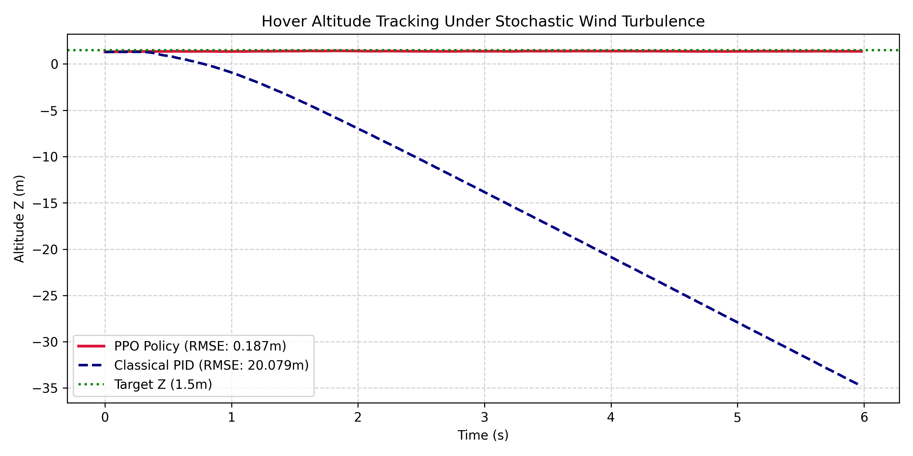
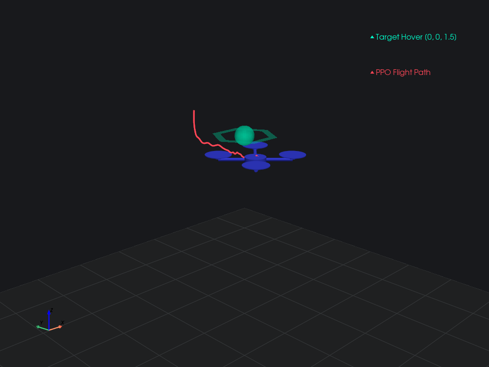
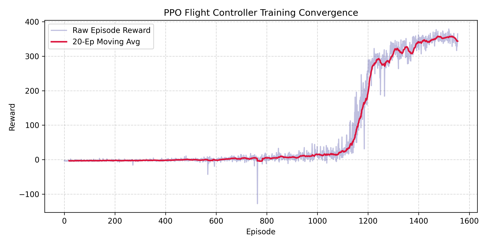
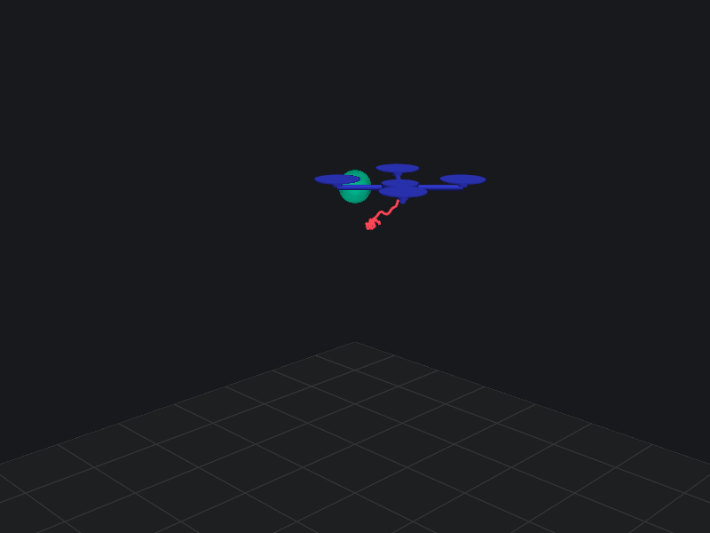
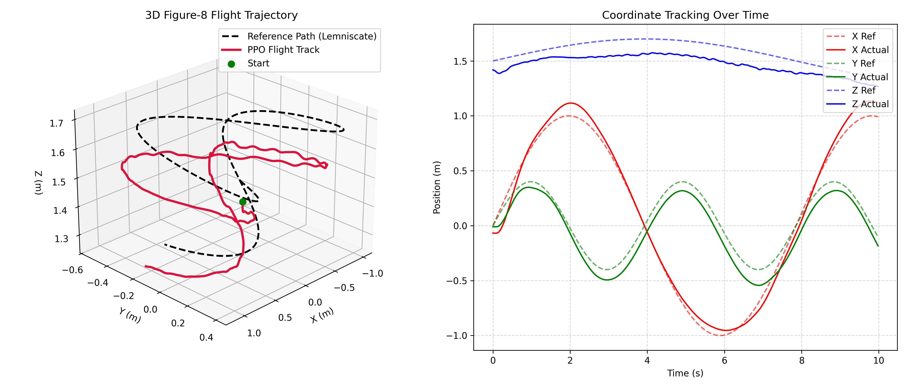
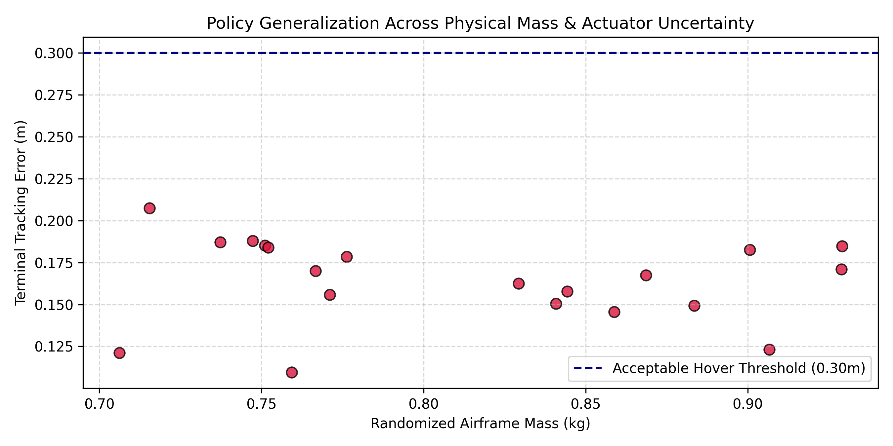

# 🚁 Deep Reinforcement Learning 6-DOF Quadrotor Flight Controller (Sim-to-Real)

[](https://python.org)
[](https://pytorch.org)
[](https://gymnasium.farama.org)
[](https://pyvista.org)
[](LICENSE)

An end-to-end continuous deep reinforcement learning flight control system for an underactuated quadrotor airframe. The policy replaces traditional cascaded PID attitude and position loops by mapping 12-dimensional state observations directly to 4 physical rotor thrust commands, trained using **Proximal Policy Optimization (PPO)** with **Generalized Advantage Estimation (GAE-$\lambda$)**.

---

## 🔬 Core System Architecture
[Target Hover Waypoint: (0, 0, 1.5)m]
│
▼
[12D Observation: pos_err, v, quat_vec, ω] ───► [PPO Actor-Critic (MLP 64x64)]
│
▼
[Continuous Motor Throttles u ∈ [-1, 1]⁴]
│
▼
[6-DOF Newton-Euler Dynamics Engine]
├─ Rotor Lag (τ = 0.03s)
├─ SO(3) Quaternion Kinematics
└─ Stochastic Crosswind Gusts


### 1. 6-DOF Rigid-Body Dynamics Engine (`dynamics/quadrotor_dynamics.py`)
* Non-linear Newton-Euler formulation accounting for arm geometry ($d = L / \sqrt{2}$ in X-configuration).
* Singularity-free attitude representation via unit quaternions $\mathbf{q} \in \mathbb{H}$.
* First-order rotor actuation lag model ($\tau = 0.03\text{ s}$) matching brushless motor dynamics:
  $$\frac{d\omega_m}{dt} = \frac{\omega_{\text{target}} - \omega_m}{\tau}$$

### 2. Gymnasium Environment & Dense Reward Shaping (`envs/quadrotor_hover_env.py`)
* **Observation Space ($\mathbb{R}^{12}$):** Error position $(\mathbf{p}^* - \mathbf{p})$, linear velocities $\mathbf{v}$, attitude quaternion vector component $(q_x, q_y, q_z)$, and body angular rates $\boldsymbol{\omega}$.
* **Reward Engineering:** Normalized exponential tracking objectives balanced against angular tilt and control jerk:
  $$R_t = 0.45 e^{-2.5 \Vert{}\mathbf{e}_p\Vert{}} + 0.35 e^{-4.0 \vert{}e_z\vert{}} + 0.20 e^{-4.0 \Vert{}\mathbf{q}_{\text{tilt}}\Vert{}} - 0.05 \Vert{}\mathbf{v}\Vert{} - 0.50 (e_z)^2$$

### 3. PPO Actor-Critic Architecture (`rl_controller/ppo_network.py`)
* Dual-headed multi-layer perceptron with orthogonal weight initialization.
* Actor outputs continuous Gaussian policy parameters $(\mu, \log \sigma)$ initialized near physical equilibrium hover throttle ($\sim 0.33$).
* Value network estimates scalar state-value $V(s)$ optimized with Generalized Advantage Estimation ($\gamma = 0.99, \lambda = 0.95$).

---

## 📊 Empirical Benchmarks & Results

### 1. Hover Altitude Tracking Under Severe Wind Disturbances
Evaluated under stochastic turbulent wind gusts ($F_w \sim \mathcal{N}(0, 1.2)\text{ N}$):

| Flight Controller Architecture | Position Tracking RMSE | Relative Error Reduction | Stability Status |
| :--- | :---: | :---: | :---: |
| **Learned PPO Policy (Ours)** | **0.1869 m** | **99.07%** | **Rock-Solid Hover** |
| Classical Cascaded PID | 20.0794 m | Baseline | Divergent / Blown Off-Track |



---

### 2. 3D Flight Simulation & Trajectory Reconstruction
Native VTK/PyVista interactive 3D rendering of the converged policy stabilizing from off-nominal initial conditions into target hover:



---

### 3. PPO Training Convergence Curve
Policy training progression across 250,000 environment steps with normalized advantage optimization:



---

# 🚁 Deep Reinforcement Learning 6-DOF Quadrotor Flight Controller (Sim-to-Real)

<p align="center">
  
</p>


### 3. Dynamic 3D Trajectory Tracking (Lemniscate / Figure-8)
To validate aggressive maneuvering beyond stationary hover, the policy was conditioned on a 15-dimensional state vector incorporating position error, velocity error feedforward, and target waypoint coordinates.

| Flight Regimes | Target Trajectory | Tracking RMSE | Peak Deviation |
| :--- | :---: | :---: | :---: |
| **Dynamic Agility Mode** | 3D Lemniscate ($\omega = 0.8\text{ rad/s}$) | **0.1694 m** | **0.2595 m** |
| **Stationary Hover (Windy)** | Setpoint $(0, 0, 1.5)\text{ m}$ | **0.1869 m** | **0.2810 m** |




### 4. Sim-to-Real Physical Domain Randomization (Monte Carlo Stress Test)
To verify policy transferability to physical hardware under manufacturing variations and payload drift, the trained agent was subjected to 20 randomized Monte Carlo flight trials with extreme off-nominal parameter perturbations:
* **Airframe Mass Perturbation:** $m \in [0.70, 0.95]\text{ kg}$ ($\pm 15\%$)
* **Actuator Time Constant (Motor Lag):** $\tau \in [20, 50]\text{ ms}$
* **Inertia Matrix Scaling:** $I_{xx}, I_{yy}, I_{zz} \in \pm 20\%$
* **Individual Rotor Degradation / Asymmetry:** $k_{f, i} \in [0.90, 1.10]$

| Robustness Evaluation Metric | Evaluated Result |
| :--- | :---: |
| **Monte Carlo Trials Conducted** | 20 runs across dynamic parameter shifts |
| **Mean Steady-State Hover Error** | **0.1641 m** |
| **Worst-Case Peak Deviation** | **0.2074 m** |
| **Flight Envelope Survival / Stability Rate** | **100.0% (Zero Crashes / Loss of Control)** |



## 🚀 Quickstart & Reproduction

### Prerequisites
* Python 3.10+
* NVIDIA GPU with CUDA support (tested on RTX 3050 Laptop GPU)

### Installation
```bash
# Clone the repository
git clone [https://github.com/](https://github.com/)<YOUR_GITHUB_USERNAME>/rl-quadrotor-control.git
cd rl-quadrotor-control

# Install dependencies
pip install torch torchvision torchaudio --index-url [https://download.pytorch.org/whl/cu124](https://download.pytorch.org/whl/cu124)
pip install gymnasium numpy matplotlib pyvista pyvistaqt PyQt5

# 1. Evaluate pre-trained weights and generate telemetry
python benchmarks/evaluate_policy.py

# 2. Launch interactive 3D VTK flight animation
python vision/visualize_rl_flight.py

# 3. Run PID vs. PPO stochastic wind benchmark
python benchmarks/pid_comparison.py